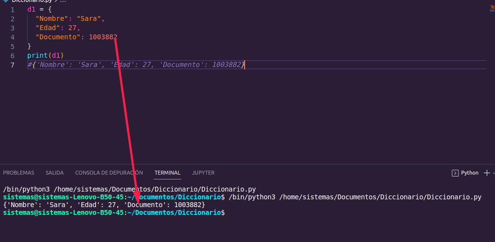
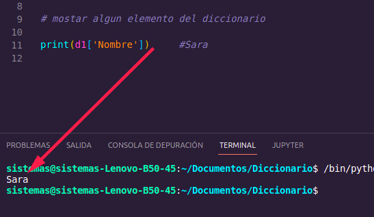
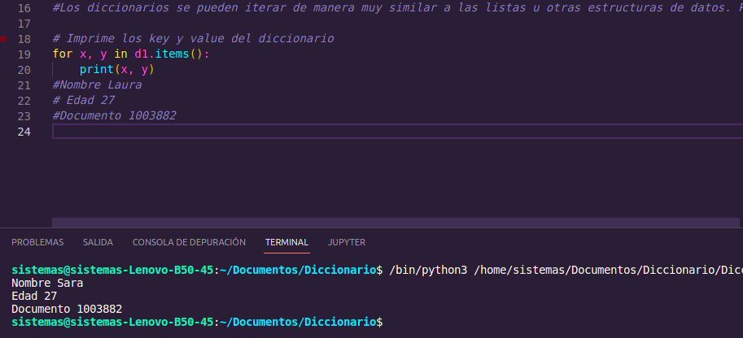

# Diccionario

## Los diccionarios se pueden crear con paréntesis {} separando con una coma cada par key: value . En el siguiente ejemplo tenemos tres keys que son el nombre, la edad y el documento. Otra forma equivalente de crear un diccionario en Python es usando dict() e introduciendo los pares key: value entre paréntesis.

#
# ejemplos 

#

# mostramos elementos del diccionario 

#

# Los diccionarios se pueden iterar de manera muy similar a las listas u otras estructuras de datos. Para imprimir los key.

